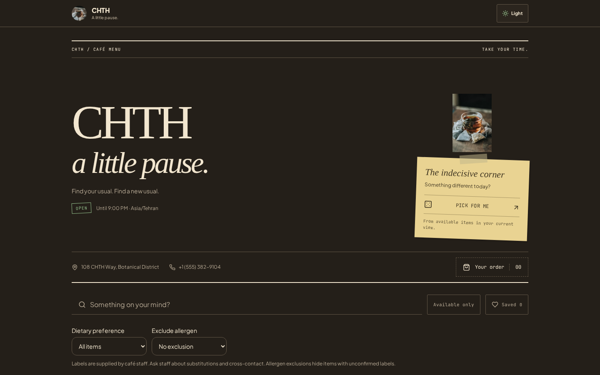
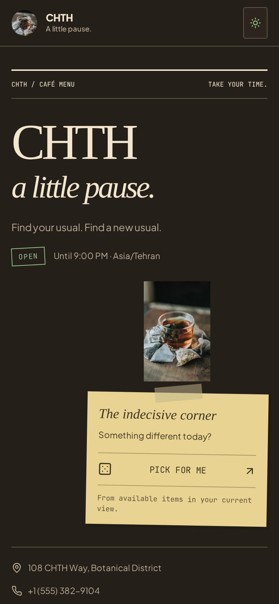
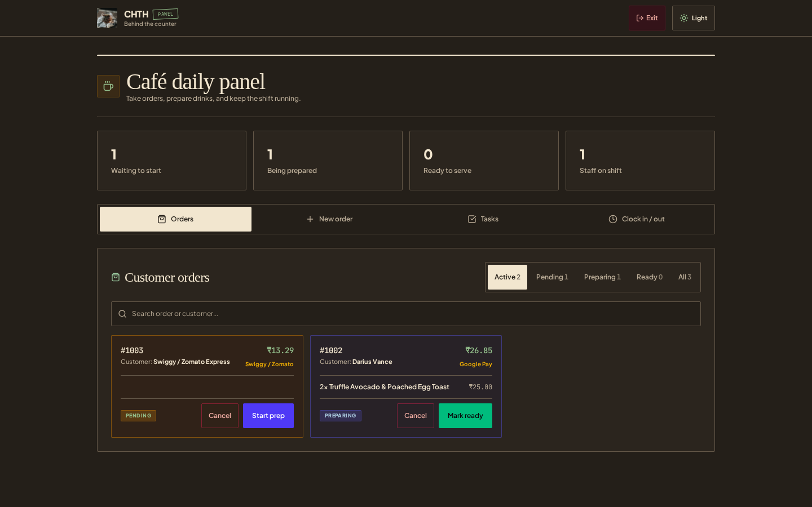
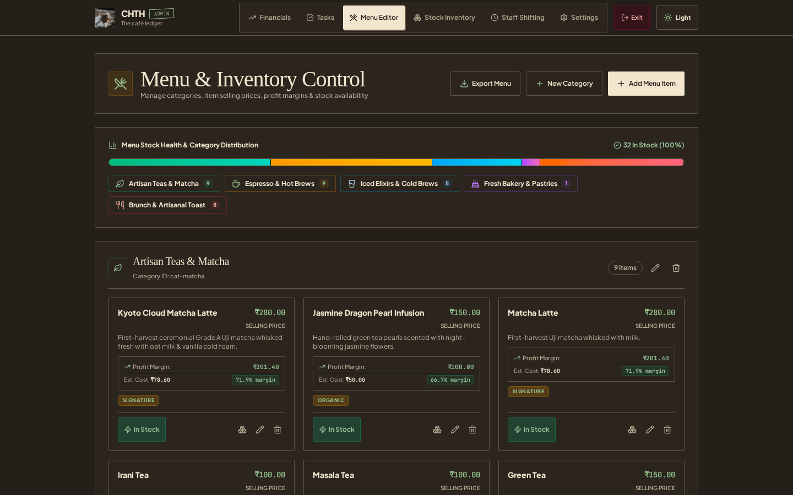
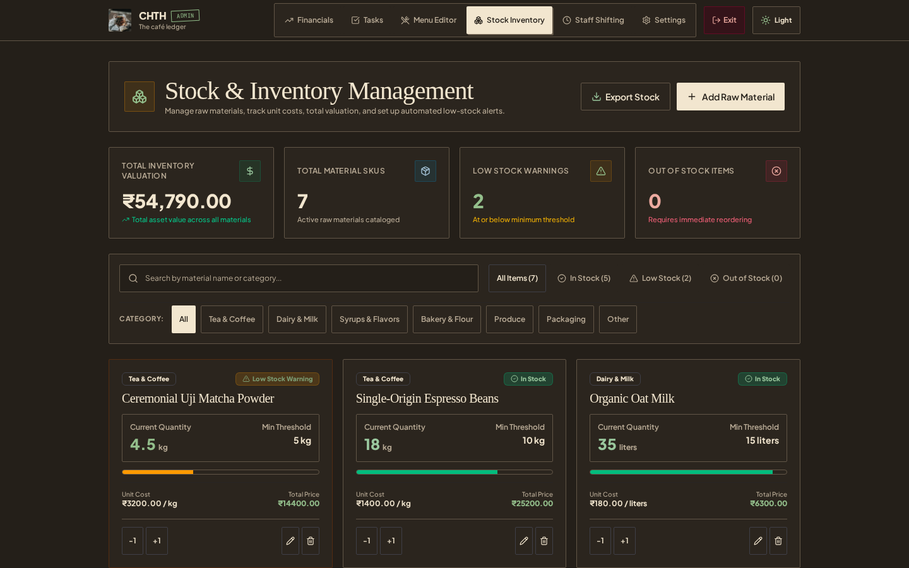

# CHTH Cafe

Cafe management with a public menu, staff workspace, and daily operations panel. Built with React, TypeScript, Tailwind CSS, and Hono on Cloudflare Workers, D1, and KV.

[](https://deploy.workers.cloudflare.com/?url=https://github.com/chethober/chth.cafe)

## Screenshots

Screenshots use the demo data from `schema.sql`.

**Public menu**

<p>
  
  
</p>

**Daily panel**: orders, new orders, tasks, and clock actions for staff on shift.



**Admin workspace**: menu pricing and margins, plus raw-material stock with low-stock alerts.





## Development

Requires Node.js 22+ and npm.

```bash
git clone https://github.com/chethober/chth.cafe.git
cd chth.cafe
npm install
npm run db:seed
npm start
```

`npm start` (or `npm run dev`) generates fresh random admin and panel passwords on every startup and prints both to stdout. It also rotates `SESSION_SECRET`, invalidating previous sessions and order tracking tokens. Credentials are saved in the Git-ignored `.dev.vars` with owner-only permissions; other local bindings are preserved.

Database seed staff credentials are random and demo staff PINs are unset; set staff PINs in the admin workspace before using clock actions.

Local apps:

- Menu: http://localhost:3000
- Admin: http://admin.localhost:3000
- Daily panel: http://panel.localhost:3000

Vite runs on port 3000 and proxies `/api` to the local Worker on port 8787. The startup scripts enable `CAFE_DEV_PROXY` locally to preserve the staff subdomain through Wrangler; do not enable this binding in deployment. Staff apps use their subdomains; `/admin` and `/panel` paths return 404.

| Command | Purpose |
| --- | --- |
| `npm start` / `npm run dev` | Generate passwords and start the UI and Worker together |
| `npm run dev:ui` | Start only Vite |
| `npm run dev:worker` | Start only the local Worker (build first) |
| `npm run db:seed` | Initialize the local database from `schema.sql` |
| `npm run db:migrate:local` | Apply `backup.sql` to the local database |
| `npm test` | Run Worker/D1 integration and timezone regression tests |
| `npm run check` | Check TypeScript types |
| `npm run build` | Check types and build production assets |

## Deploy

Use the button above to start the [Cloudflare deployment flow](https://developers.cloudflare.com/workers/platform/deploy-buttons/), or deploy from the CLI:

1. Create a D1 database and KV namespace, then put their IDs in `wrangler.jsonc`.
2. Update the custom domain routes for your cafe. The menu, admin, and panel use the main domain, `admin` subdomain, and `panel` subdomain respectively.
3. Sign in and set the required Worker secrets:

   ```bash
   npx wrangler login
   npx wrangler secret put ADMIN_PASSWORD
   npx wrangler secret put PANEL_PASSWORD
   npx wrangler secret put SESSION_SECRET
   ```

4. Initialize a new remote database and deploy:

   ```bash
   npm run db:seed:remote
   npm run deploy
   ```

For the button flow, use `npm run deploy` as the deploy command; it builds the app before publishing. Verify the domain routes, required secrets, and database initialization before using the app.

Telegram notifications optionally use `TELEGRAM_BOT_TOKEN` and `TELEGRAM_CHAT_ID`. Set the cafe timezone and opening hours in Settings before accepting orders.

## Contributing

See [CONTRIBUTING.md](CONTRIBUTING.md), [CODE_OF_CONDUCT.md](CODE_OF_CONDUCT.md), and [SECURITY.md](SECURITY.md).

[MIT License](LICENSE).

Admin and panel use separate passwords and sessions. Admin manages finances, menu, inventory, staff, and settings. Panel manages daily orders, menu availability, tasks, and clock actions; its API access cannot change admin settings or financial and staff records. Set `PANEL_PASSWORD` separately from `ADMIN_PASSWORD`.
